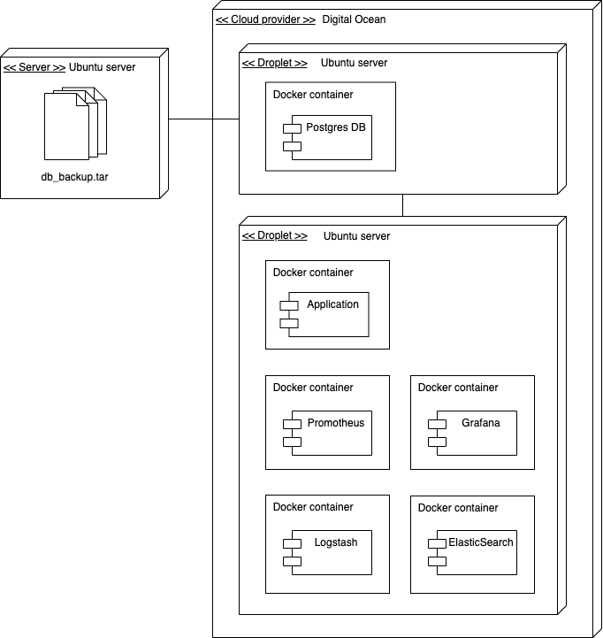
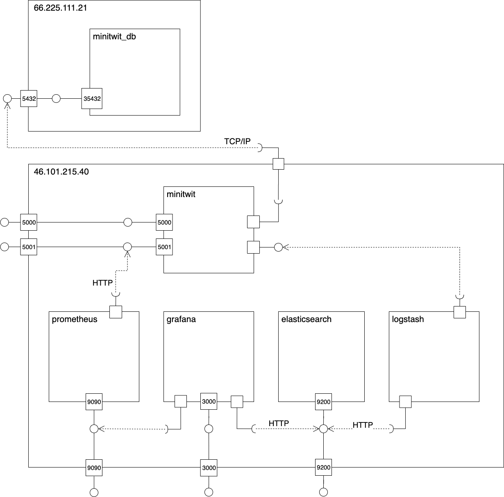

## 2.01 Design and Architecture
This chapter seeks to describe the overall architecture of the implementation as well as to give an understanding of how the individual subsystems are physically positioned.

The following constitutes all of the subsystems in the implemented Minitwit application and are presented here to give a brief overview:

- Minitwit (`Application` in the diagram) consists of the web application, both the user interface and the API
- Prometheus is used for monitoring our system
- Logstash and Elasticsearch are used to handle the log data of our system
- Grafana is used for visualizing monitoring and logging data
- Postgres DB is the database running in a docker container on a separate node
- db_backup.tar symbolizes the physical backup of the application database, persisted on an external server.

### Deployment overview
The shown deployment diagram gives an overview of where different modules of the system is deployed, and the different applications or artifacts each node is responsible for.

It can be seen that all the subsystems except for the database run on the same Digitial Ocean droplet. Each subsystem runs in its own Docker container. This makes the system or subsystems easy to deploy elsewhere. If for instance we wanted to deploy Grafana on a separate server we would just have to specify the new address the service is running at.

### Minitwit application architecture
Here a description of the modules in the application is given. The diagram below shows the layers that are used to partition the code base into layers of coherence.

The nature of node.js (javascript) happens to be such that the use of interfaces or similar constructs is not natural to use when attempting to define layers of abstraction. Instead we patitioned the modules into layers to make a distinction between layers of abstraction in the code. 

The `Controller` module passes information about requests and responses to the monitoring module. The dependency is found in the routing module because the collected data is exposed through an API endpoint. This is the data that Prometheus monitors and is described further in
section [3.04 - Monitoring and Logging](../chapters/304_monitoring_and_logging.md).

The `Routing`, `Controller`, `Repository` and `Persistence` modules all make use of the `Logging` module in order to log certain events. This is described in more detail in 
section [2.03 - Interactions of Subsystems](../chapters/203_interactions_of_subsystems.md).

The layered architecture makes the overall application and interaction between the modules straight ahead to understand, however the layered architecture is not necessarily the most efficient as the requests have to pass through several layers when being processed. 

#### Handling of a http request
The `server` is the entry point into the application and starts up services listening on specific ports as well as making a query to the database making sure there is a connection. Whenever a request arrives eg. at an endpoint in the `Api` or through the `WebUI`, the request traverses down into the application logic until it reaches the `Controller` layer. This layer handles the business-logic, which in this application amounts to handling HTTP requests and responses.

In the `Controller` the request is dismantled and only data needed to process the request further continues down into the `Repository` layer, which query the database through the `ORM` objects and make sure the correct data or perhaps appropriate errors are returned. When control once again returns to the `Controller`, depending on the returned data, it makes sure that an appropriate HTTP response is created and returned to the initial sender of request.

#### Choice of database
<!-- Just after translating the Minitwit application to Node.js we made use of a local Sqlite database.  -->
Initally we chose to reuse the Sqlite database from the original Python implementation because this was a fine prototypical choice to get a good start with not too many moving parts. 

However Sqlite is not a database to be used in production as it is too simple. It does not scale well and data is easily corrupted. 
We decided to implement a production-worthy database and we found that the best options were either MySQL or Postgres.

When deciding between MySQL and Postgres we did not encounter that many differences in relation to a simple system like this. Both databases seemed to be more less equally efficient. We decided on using Postgres as we found it to be better "out of the box" because of its support for more data types such as booleans. Furthermore one member of the group had had some experience with Postgres earlier. Adding to this, Postgres seemed to perform better in benchmarkings, eg. by handling concurrency better than MySQL.
(https://developer.okta.com/blog/2019/07/19/mysql-vs-postgres)
 
More details about how we migrated between databases can be found in
section [3.06 - Scaling and Balancing](../chapters/306_scaling_and_load_balancing.md).

### The docker setup
It makes a lot of sense to setup the application using docker containers, the first and main reason for us being that we could more esaliy setup an identical development environment for each of the involved developers. As an example: just for our 5-person group we had two different flavors of Linux distributions, Windows computers and Apple Macs.
The second essential reason is that we would like to be able to replicate our production environment as closely as possible in order to not get too many suprises after having deployed on the production server.

The following component and connector diagram gives an overview of the docker network and containers' paths of communication in the system. The outer boxes are the two Digital Ocean nodes, while the inner boxes are the docker containers. The names of the containers are their respective name within the docker network. 
The diagram shows what ports on the containers are mapped to what ports on the device.

#### Controlling docker with a script
The way Docker is setup is through a multitude of Dockerfiles and docker-compose files all handled through the `run.sh` script, which is an automating script to make it easy for all developers to interact with the docker setup, also without any prior knowledge of docker commands. 

Dockerfiles are used to create customized docker images containing source code or configs and docker-compose.yml files are used to combine Dockerfiles and setup a network between the containers as well as docker volumes to persist data.

The `run.sh` script makes it easy to to start different parts of the docker setup, such as a testing environment, running only python-containerized tests or just starting the database locally.
The actual reason it was introduced was because of an issue in relation to one container not being fully started when a depending container needed it.

<!-- // TODO: Make sure that this has been commented in 401 as technical debt! -->
This approach does not seem to be within the conventions of using Docker however well it worked. See more details and afterthoughts in
section [4.01 - Current System State](../chapters/401_current_system_state.md).

---
[ [prev page](../chapters/200_systems_perspective.md) | [table of content](../table_of_content.md) | [next page](../chapters/202_dependencies.md) ]
